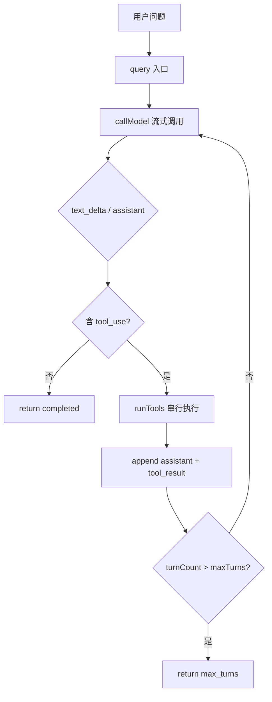

# react-agent-mini 架构导读

最简 ReAct Agent，目录与类型签名对齐 [claude-code-best](https://github.com/jimchou-h/claude-code)（下称 **claude-code**），便于从本仓库逐步扩展到完整 CLI。

## 设计目标

| 目标 | 说明 |
|------|------|
| 可运行 | headless CLI + 交互 REPL |
| 可学习 | 核心循环 ~150 行，中文注释 |
| 可扩展 | 模块边界与 claude-code 同构，换 Provider / 加工具不改 `query.ts` |

**刻意不做**：Ink UI、权限弹窗（REPL 用 stdin y/n）、会话持久化、SSE/HTTP MCP、compact、并发工具。

## ReAct 主循环

一次 `query()` 调用处理**一轮用户输入**（内部可多轮 tool）。多轮用户对话由 L1 `QueryEngine` 持有 `messages[]` 并反复 `runTurn`。



对应源码：`src/query.ts` 的 `queryLoop()`。

**终止条件**（不依赖 API `stop_reason`）：

1. 模型响应中**没有** `tool_use` 块 → `completed`
2. 工具轮次超过 `maxTurns`（默认 20）→ `max_turns`

## 模块职责

```
src/
├── entrypoints/
│   ├── cli.ts                 # 路由：REPL / headless / pipe
│   ├── repl.ts                # readline REPL + slash
│   ├── consumeQueryStream.ts  # 共用流式 stdout/stderr
│   └── cliHelpers.ts
├── QueryEngine.ts             # L1 会话：messages 累积、runTurn、clear
├── query.ts                   # L2 ReAct 主循环（public API）
├── query/
│   ├── deps.ts                # QueryDeps 依赖注入
│   └── types.ts               # QueryParams、Terminal、CallModel
├── skills/
│   ├── discover.ts            # 扫描并解析 SKILL.md
│   └── systemPrompt.ts        # 会话快照 + 可用 Skills 摘要
├── Tool.ts                    # Tool 契约、ToolUseContext、CanUseTool
├── permissions/
│   └── canUseTool.ts          # REPL y/n 与 headless ALLOW_WRITE 策略
├── tools/                     # Echo、Read、Grep、Glob、Skill、Write + getTools()
├── services/
│   ├── api/
│   │   ├── client.ts          # callModel 入口
│   │   ├── mock.ts            # QUERY_MOCK 假模型
│   │   └── openai/            # DeepSeek 适配层
│   ├── mcp/
│   │   ├── config.ts          # .mcp.json 加载
│   │   ├── adapter.ts         # MCP tool → Tool
│   │   ├── client.ts          # stdio 连接与 listTools
│   │   └── load.ts            # 启动合并 sessionTools
│   └── tools/
│       ├── execution.ts       # 单工具 runToolUse（可注入 canUseTool）
│       └── orchestration.ts   # 串行 runTools
├── types/message.ts
└── utils/
    ├── messages.ts
    ├── projectContext.ts          # AGENTS.md / CLAUDE.md → systemPrompt
    └── trace.ts                   # TRACE=1 结构化调试日志
```
### 数据流（单次 tool 轮）

1. **出站**：可选 `systemPrompt` + `messages` + `tools` → `adapter.ts` 转为 OpenAI Chat Completions（system 在 messages 首位）
2. **入站**：`stream.ts` 解析流 → `text_delta` + `assistant`（含 `tool_use`）
3. **执行**：`runToolUse` 校验 input（Zod）→ `canUseTool` → `tool.call()` → `tool_result`
4. **回环**：`appendTurnMessages` 把 assistant + tool_results 追加进 `messages`

### 权限策略（v2）

| 模式 | 只读工具 | Write |
|------|----------|-------|
| 未注入 `canUseTool` | auto-allow | auto-allow（仅测试默认） |
| REPL | allow | stdin 询问 `y/N`；`n` 则 abort 本轮 |
| headless / pipe | allow | deny，除非 `ALLOW_WRITE=1` |

内部消息统一为 **Anthropic 形态**（`tool_use` / `tool_result`），与 claude-code 一致；DeepSeek 差异由 `services/api/openai/` 吸收。

## 项目上下文（systemPrompt）

启动时（REPL / headless / pipe）调用 `loadProjectContext()`：

1. 自 `cwd` 向上查找（最多 5 层，遇 git root 停止）
2. 同目录优先：`AGENTS.md` 与 `CLAUDE.md` 都有则合并（AGENTS 在前）；仅其一则加载该文件
3. 合并后超过 **64KB** 截断并注明
4. 结果作为 `systemPrompt` 传入 `QueryEngine` / `query` / `callModel`；**不写入**对话 `messages[]`

因此 REPL `/clear` 只清空会话历史，**不清除**项目上下文。无上下文文件时行为与 v1 一致（静默跳过）。

## Skills 扩展

`loadSessionContext()` 在进程启动时并行加载项目上下文与 workspace skills，形成整场会话复用的快照：

1. `discoverSkills()` 扫描 `.agents/skills/*/SKILL.md` 与 `.claude/skills/*/SKILL.md`
2. 解析 frontmatter 的 `name` / `description`，正文上限 32KB
3. `buildSystemPrompt()` 把名称摘要追加到 project context
4. 模型调用只读 `Skill({ skill })`，正文作为 `tool_result` 回注下一轮推理

Skill 正文不会永久追加到 system prompt；仅目录摘要常驻。这样既可发现具名工作流，又避免所有技能正文占满上下文。`/clear` 不重扫目录。

## Provider 适配层

| 环境变量 | 默认值 | 说明 |
|----------|--------|------|
| `OPENAI_API_KEY` | （必填） | DeepSeek API Key |
| `OPENAI_BASE_URL` | `https://api.deepseek.com` | OpenAI 兼容端点 |
| `OPENAI_MODEL` | `deepseek-chat` | 模型名 |
| `QUERY_MOCK` | — | `1` 时使用内置 mock，无需 Key |

Mock 模式：`productionDeps()` 绑定 `mockEchoCallModel`，可验证 Echo 闭环，无需网络。

## CLI 模式

| 模式 | 示例 | 行为 |
|------|------|------|
| REPL | `bun run dev` / `dev:mock` / `dev:repl` | 无问题参数 → `> ` 多轮对话 |
| 参数问答 | `bun run dev:mock -- "用 Echo 回复 hello"` | headless 单次 |
| Pipe | `echo "问题" \| bun run dev -p` | stdin 单次 |
| 真实模型 | `bun run dev -- "读取 README.md"` | 需 `OPENAI_API_KEY` |

Slash（仅 REPL）：`/help`、`/clear`、`/exit`（`/quit`）。

输出约定：

- 模型文本 → **stdout**（`text_delta` 流式）
- 工具状态 → **stderr**（`[工具] Read: path`）

## TRACE 调试日志

设置 `TRACE=1` 时，关键边界向 stderr 打印 `[trace] stage key=value …`：

| stage | 含义 |
|-------|------|
| `cli.start` | CLI 启动（mode） |
| `query.turn_start` / `query.turn_end` | ReAct 每轮开始/结束（含 reason） |
| `api.request` / `api.assistant` | 真实模型请求摘要 / 流结束 |
| `tool.start` / `tool.end` | 工具执行边界 |

默认关闭，无开销。stage 列表与示例见 [`docs/trace-flow.md`](./trace-flow.md)。

## 与 claude-code 的扩展映射

从本仓库向 claude-code 演进时，模块大致一一对应：

| react-agent-mini | claude-code | 扩展内容 |
|------------------|-------------|----------|
| `query.ts` | `src/query.ts` | compact、hooks、流式工具、权限回调 |
| `query/deps.ts` | `src/query/deps.ts` | 更多 IO 依赖 |
| `Tool.ts` | `src/Tool.ts` | 完整 `canUseTool`、MCP 工具 |
| `tools/*` | `packages/builtin-tools/` | Bash、Agent…（Write 已在本仓库） |
| `permissions/canUseTool.ts` | `canUseTool` 钩子 / 权限 UI | 规则引擎、always-allow、Ink 弹窗 |
| `skills/*` + `SkillTool` | Skill 系统 | 插件源、fork Agent、Skill 内 MCP |
| `services/api/openai/` | `src/services/api/openai/` | thinking mode、多模型映射 |
| `QueryEngine.ts` | `src/QueryEngine.ts` | compact、file history、attribution |
| `utils/projectContext.ts` | `src/context.ts` / `claudemd.ts` | 完整 memory、git status、多级 CLAUDE 树 |
| `entrypoints/cli.ts` + `repl.ts` | `src/main.tsx` + `REPL.tsx` | Ink UI、权限弹窗 |
| `services/tools/orchestration.ts` | 同名 | `partitionToolCalls` 并发分区 |

建议扩展顺序：

1. **规则化权限 / always-allow** — 在现有 `canUseTool` 钩子上扩展
2. **compact** — 长对话截断
3. **Ink REPL** — 替换 readline
4. **MCP / Agent 子任务** — 对齐 claude-code 工具注册表

## 测试策略

- 单元测试：工具、adapter、cliHelpers、query 循环（注入 fake `callModel`）
- 不 mock 业务上层模块，依赖通过 `QueryDeps` 注入
- 验收：`bun test` + `bun run typecheck`

## 延伸阅读

- 根目录 [`CONTEXT-MAP.md`](../CONTEXT-MAP.md) — 各模块术语表入口
- OpenSpec：[`openspec/changes/minimal-react-agent/`](../openspec/changes/minimal-react-agent/)
